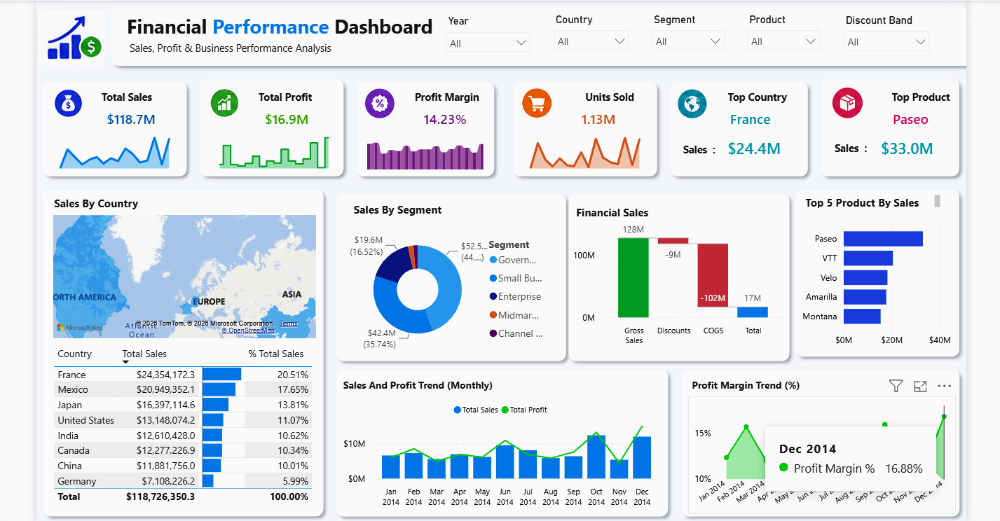

# 📊 Financial Performance Dashboard | Power BI

## 📌 Project Overview

This project is an interactive Financial Performance Dashboard built using Microsoft Power BI. It provides insights into sales, profit, profitability, products, customer segments, and country-wise performance using interactive visualizations and DAX.

---

## 🎯 Business Objective

The objective of this dashboard is to help businesses:

- Monitor sales performance
- Analyze profit and profit margin
- Identify top-performing products
- Compare country-wise sales
- Analyze customer segments
- Track monthly business performance

---

## 🛠️ Tools & Technologies

- Microsoft Power BI
- DAX (Data Analysis Expressions)
- Power Query
- Microsoft Excel

---

## 📂 Dataset

**Dataset:** Financial Sample

The dataset contains:

- Sales
- Profit
- Gross Sales
- COGS
- Units Sold
- Products
- Countries
- Segments
- Discounts

---

## 📊 Dashboard Features

### KPI Cards

- Total Sales
- Total Profit
- Profit Margin
- Units Sold
- Top Country
- Top Product

### Interactive Filters

- Year
- Country
- Segment
- Product
- Discount Band

### Visualizations

- Sales by Country (Map)
- Waterfall Chart
- Donut Chart
- Bar Chart
- Monthly Sales & Profit Trend
- Profit Margin Trend
- Country-wise Sales Table

---

## 🧮 DAX Measures Used

- Total Sales
- Total Profit
- Profit Margin
- Units Sold
- Top Country
- Top Product

A Calendar table was created using DAX to enable time-based analysis.

---

## 🧹 Data Preparation

Data was transformed using Power Query by:

- Cleaning data
- Validating data types
- Preparing the dataset for reporting

---

## 📸 Dashboard Preview



---

## 📁 Project Structure

```text
Financial-Performance-Dashboard-PowerBI
│
├── README.md
├── Financial Dashboard.pbix
├── Dataset
│   └── Financial Sample.xlsx
└── Screenshots
    └── Dashboard.png
```

---

## 💼 Skills Demonstrated

- Power BI
- DAX
- Power Query
- Data Modeling
- KPI Design
- Business Intelligence
- Data Visualization
- Interactive Reporting

---

## 🚀 How to Use

1. Download the repository.
2. Open `Financial Dashboard.pbix` in Power BI Desktop.
3. Refresh the data if required.
4. Explore the dashboard using the filters.

---

## 👨‍💻 Author

**Sammed Chougule**

If you found this project useful, consider giving it a ⭐ on GitHub.